# HRM System — Hệ Thống Quản Lý Nhân Sự

> A modern Human Resource Management web application built with **Django 5.2**, Bootstrap 5 and a clean dark-sidebar UI.

## Link: https://human-resoruce-management.onrender.com/

## ✨ Features

| Module             | Capabilities                                                          |
| ------------------ | --------------------------------------------------------------------- |
| **Employees**      | Add / edit / delete employees, avatar initials, status badges         |
| **Departments**    | Org structure, department cards                                       |
| **Leave Requests** | Submit, approve, reject, cancel; admin manage all, non-admin view own |
| **Attendance**     | Daily bulk check-in, per-employee history, working-hours calculation  |
| **Chat System**    | Real-time messaging between employees (WebSocket-enabled)             |
| **Dashboard**      | Live stat cards (total, active, departments, on-leave) + quick links  |
| **Auth**           | Django `LoginView` / `LogoutView` with CSRF-safe POST logout          |
| **Admin Panel**    | Full Django admin for all models                                      |

## 📸 Screenshots

### Login

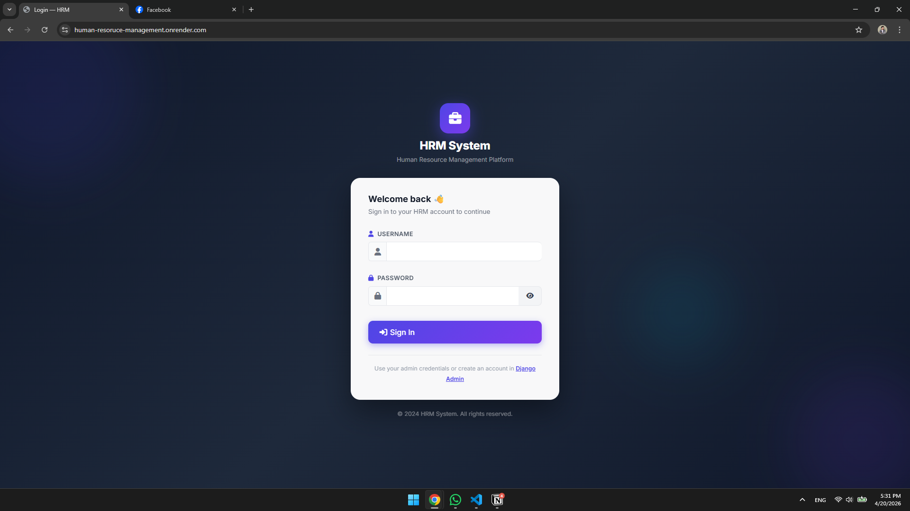

### Dashboard

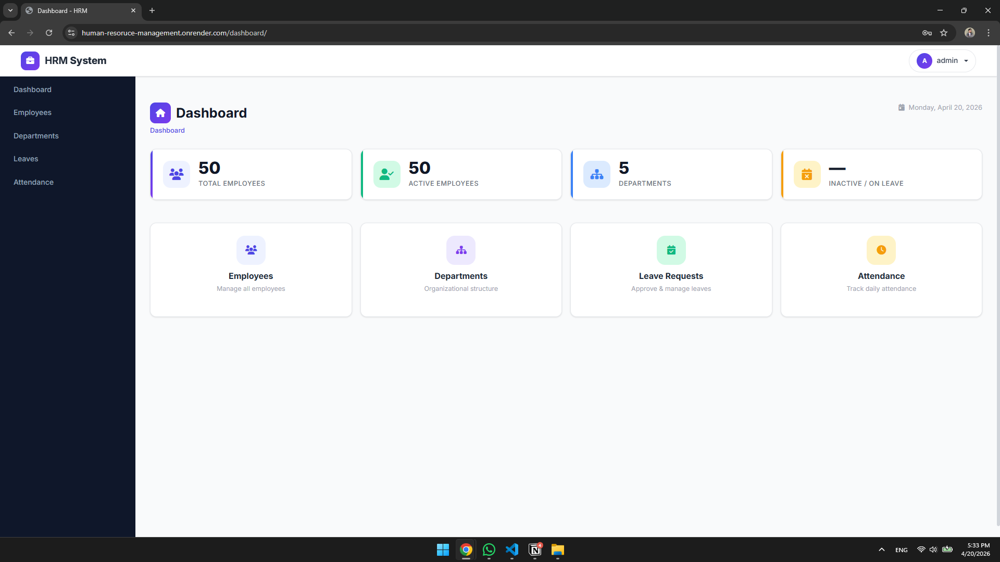

### Employees

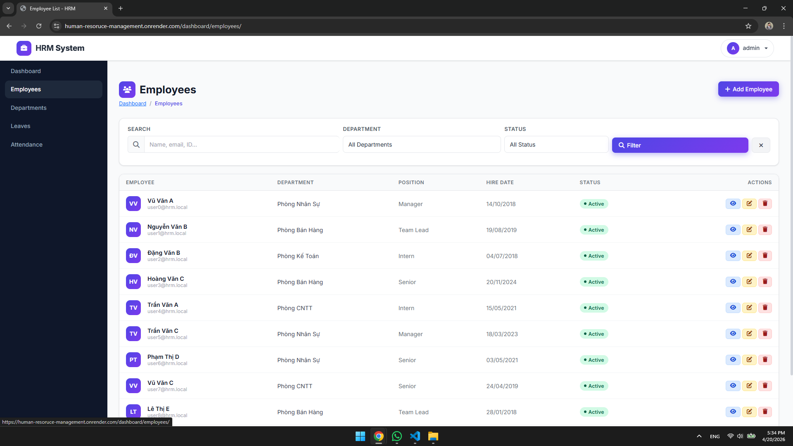

### Create Employees

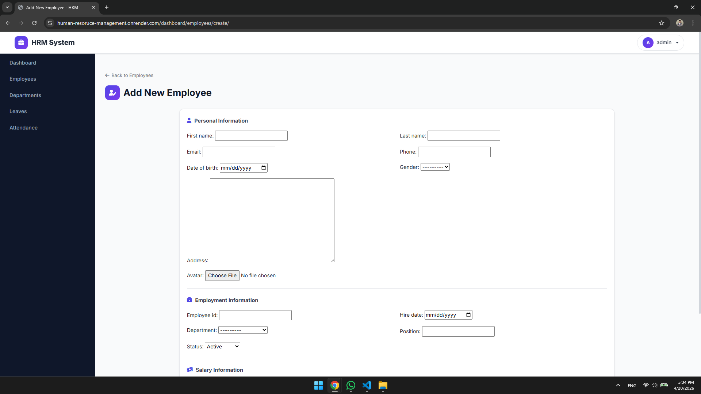

### Employee Profile

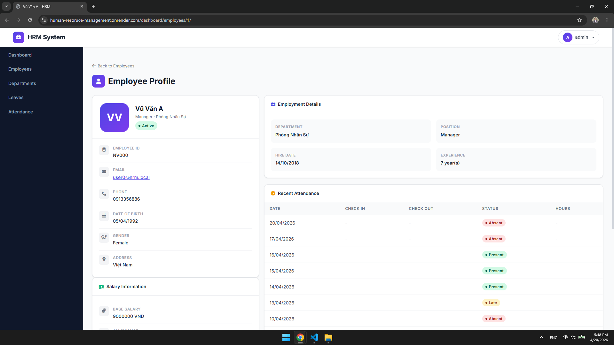

### Departments

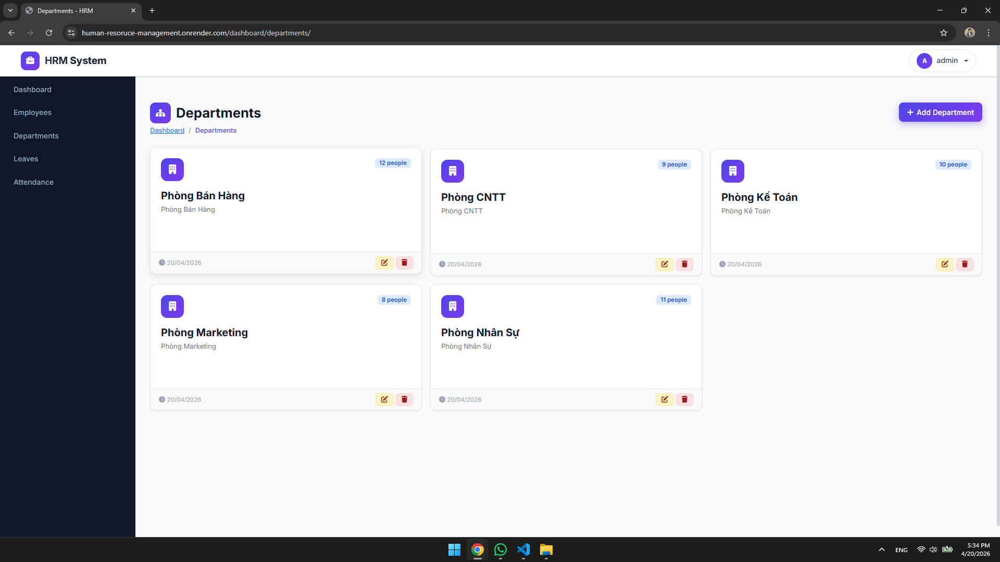

### Create departments

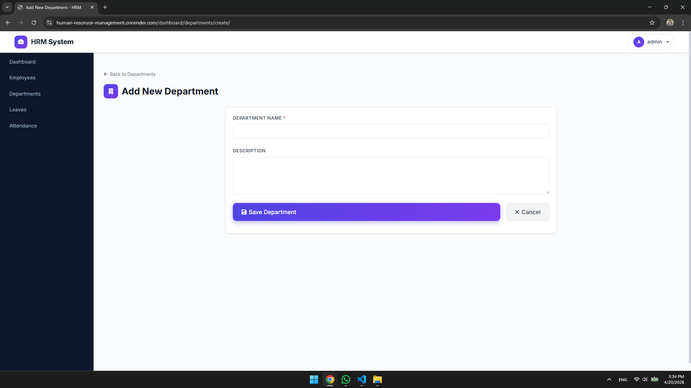

### Leave Requests

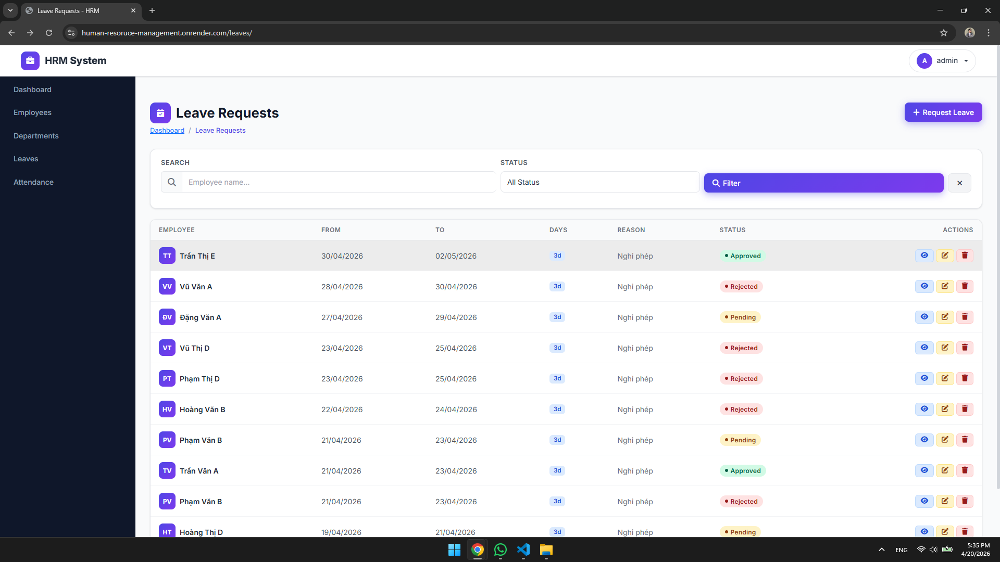

### Create Leaves request

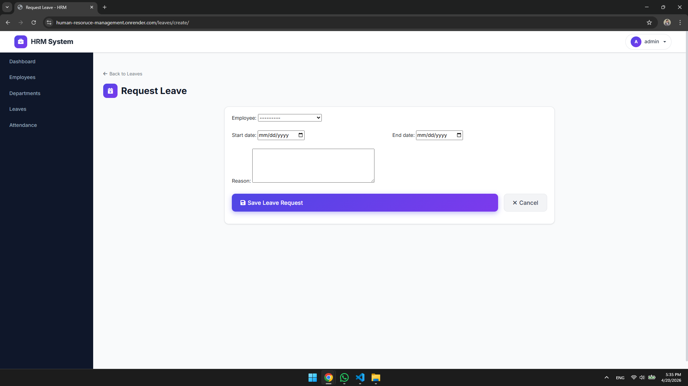

### Confirm Leaves

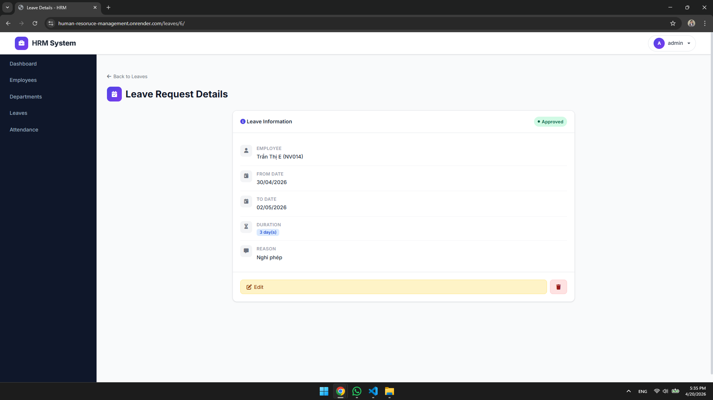

### Attendance

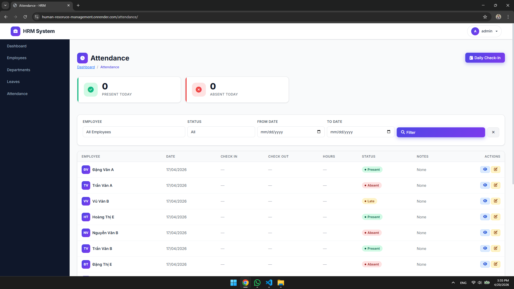

### Apply daily attendance

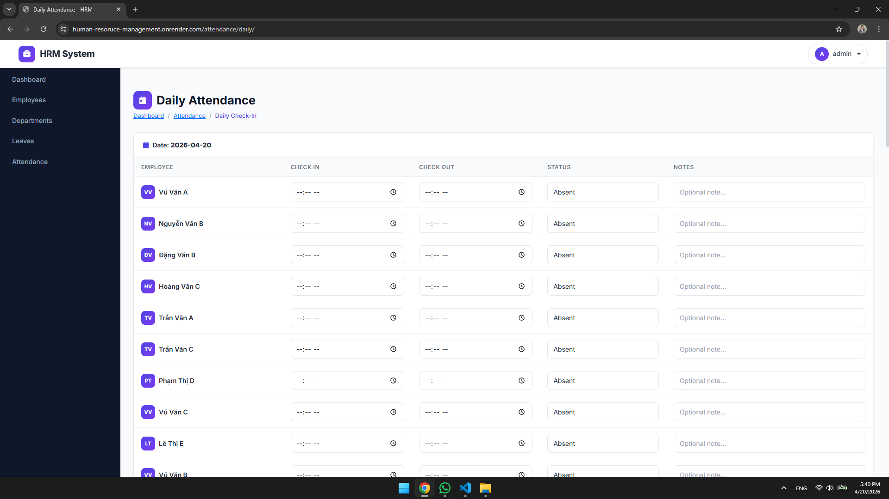

###

## 🛠️ Tech Stack

- **Backend**: Django 5.2, Python 3.13
- **Database**: SQLite (dev) / PostgreSQL (prod)
- **Frontend**: Bootstrap 5.3, Font Awesome 6.4, Inter font (Google Fonts)
- **Auth**: Django built-in authentication
- **Deploy**: gunicorn, render

## ⚡ Quick Start

### 1. Clone & activate venv

```bash
git clone <repo-url>
cd hrm_project

python -m venv venv
# Windows
venv\Scripts\activate
# Linux / Mac
source venv/bin/activate
```

### 2. Install dependencies

```bash
pip install -r requirements.txt
```

### 3. Apply migrations

```bash
python manage.py migrate
```

### 4. Seed demo data (creates admin + 12 employees + 5 departments + 12 leaves + 360 attendance records)

```bash
python scripts/seed_data.py
```

### 5. Run the server

```bash
python manage.py runserver
```

Open **http://localhost:8000** and log in with `admin` / `admin123`.

## � Default Credentials

| Role         | Username | Password   | URL                         |
| ------------ | -------- | ---------- | --------------------------- |
| Admin        | `admin`  | `admin123` | http://localhost:8000       |
| Django Admin | `admin`  | `admin123` | http://localhost:8000/admin |

## 📁 Project Structure

```
hrm_project/
├── config/                  # Django settings, URLs, forms
│   ├── settings/base.py
│   ├── urls.py
│   ├── forms.py             # Custom LoginForm with Vietnamese messages
│   ├── wsgi.py
│   └── asgi.py
├── core/
│   ├── employees/           # Employee & Department module
│   ├── leaves/              # Leave request module
│   └── attendance/          # Attendance module
├── common/                  # Shared base model
├── templates/               # Global templates (base, dashboard, auth)
├── static/css/main.css      # Design system (CSS variables, components)
├── scripts/seed_data.py     # Demo data seeder (12 employees, etc.)
├── docs/screenshots/        # README screenshots
└── manage.py
```

## � Security Features

- ✅ Django CSRF protection on all forms
- ✅ Logout uses **HTTP POST** (Django 5+ requirement) — not plain `<a>` link
- ✅ Passwords hashed via PBKDF2
- ✅ SQL injection prevention via Django ORM
- ✅ XSS protection via Jinja2 template engine

## 🚢 Production Checklist

```bash
# .env
SECRET_KEY=<long-random-string>
DEBUG=False
ALLOWED_HOSTS=yourdomain.com
DB_ENGINE=django.db.backends.postgresql
DB_NAME=hrm_db
```

- [ ] Switch to PostgreSQL
- [ ] Run `python manage.py collectstatic`
- [ ] Use Gunicorn + Nginx
- [ ] Set `SECURE_SSL_REDIRECT=True`
- [ ] Change admin username/password
- [ ] Set up HTTPS certificates

## 📊 Data Models

### Employee

| Field                      | Type                                                 |
| -------------------------- | ---------------------------------------------------- |
| `employee_id`              | CharField (unique)                                   |
| `first_name`, `last_name`  | CharField                                            |
| `email`                    | EmailField (unique)                                  |
| `phone`                    | CharField                                            |
| `date_of_birth`            | DateField                                            |
| `gender`                   | CharField (M/F/O)                                    |
| `department`               | ForeignKey → Department                              |
| `position`                 | CharField                                            |
| `hire_date`                | DateField                                            |
| `status`                   | CharField (ACTIVE / INACTIVE / SUSPENDED / ON_LEAVE) |
| `base_salary`, `allowance` | DecimalField                                         |

### Leave

| Field                    | Type                                                  |
| ------------------------ | ----------------------------------------------------- |
| `employee`               | ForeignKey → Employee                                 |
| `start_date`, `end_date` | DateField                                             |
| `reason`                 | TextField                                             |
| `status`                 | CharField (PENDING / APPROVED / REJECTED / CANCELLED) |
| `approved_by`            | ForeignKey → Employee (nullable)                      |
| `remarks`                | TextField                                             |

### Attendance

| Field                             | Type                                                                    |
| --------------------------------- | ----------------------------------------------------------------------- |
| `employee`                        | ForeignKey → Employee                                                   |
| `date`                            | DateField                                                               |
| `check_in_time`, `check_out_time` | TimeField                                                               |
| `status`                          | CharField (PRESENT / ABSENT / LATE / EARLY_LEAVE / HALF_DAY / ON_LEAVE) |
| `notes`                           | TextField                                                               |

## 🔐 Role-Based Access Control

### Leave Request Management

| Action                   | Admin | Non-Admin |
| ------------------------ | ----- | --------- |
| View all leave requests  | ✅    | ❌        |
| View own leave requests  | ✅    | ✅        |
| Create leave request     | ✅    | ✅        |
| Edit own pending leave   | ✅    | ✅        |
| Delete own pending leave | ✅    | ✅        |
| Approve leave request    | ✅    | ❌        |
| Reject leave request     | ✅    | ❌        |
| Search/Filter leaves     | ✅    | ❌        |

**Navigation:**

- **Admin**: Can see all menu items (Dashboard, Employees, Departments, Leave Requests, Attendance, Chat)
- **Non-Admin**: Can only see Leave Requests and Chat in the sidebar

### Leave Request Workflow

1. **Non-Admin User**
   - Creates a leave request with their own employee record auto-filled
   - Can edit/delete only their own PENDING requests
   - Cannot modify status or approval information

2. **Admin User**
   - Creates leave requests on behalf of any employee
   - Approves or rejects any pending request
   - Can view and filter all leave requests
   - Sets remarks on rejected requests

## 💬 Chat System

The application includes a **real-time chat system** powered by Django Channels:

- ✅ WebSocket support for live messaging
- ✅ One-to-one messaging between employees
- ✅ Message history persistence
- ✅ Real-time notifications
- ✅ Accessible from sidebar for both admin and non-admin users

**Setup for Chat:**

```bash
# Chat requires Redis for Channels Layer
pip install channels channels-redis
# Docker setup already includes Redis (see docker-compose.yml)
```

## 🌐 Usecase & Services Pattern

The project follows a clean architecture with separation of concerns:

```
core/
├── <module>/
│   ├── models/         # Database models
│   ├── views/          # Django views (handles HTTP requests)
│   ├── usecase/
│   │   ├── selectors/  # Read-only queries (data retrieval)
│   │   └── services/   # Business logic (write operations)
│   ├── urls.py
│   └── admin.py
```

**Benefits:**

- Clear separation between read queries (selectors) and write operations (services)
- Testable business logic independent of views
- Reusable database access patterns

## � License

MIT License

---
